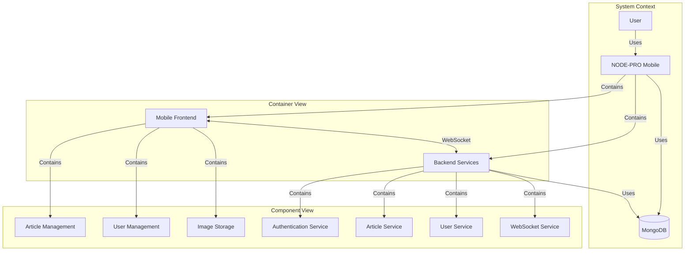

# NODE-PRO Mobile

## Project Description

NODE-PRO Mobile is a mobile version of the NODE-PRO web application, developed using React Native. It aims to provide a seamless mobile experience while maintaining synchronization with the web version through a microservices architecture.

## C4 Diagram

Here's a high-level C4 diagram of the NODE-PRO Mobile system:

## Design Patterns

The project utilizes several design patterns:

1. **MVC (Model-View-Controller)**
2. **Repository Pattern**
3. **Observer Pattern**
4. **Singleton Pattern**
5. **Middleware Pattern**

## Technology Stack

- **Frontend**:

  - React Native
  - Expo
  - WebSocket client

- **Backend**:

  - Node.js
  - Express.js
  - MongoDB (with Mongoose ODM)
  - WebSocket (ws library)
  - JSON Web Tokens (JWT)

- **DevOps**:
  - Git
  - npm

## Key Objectives

1. Maintain feature parity with the web version
2. Ensure data consistency across platforms
3. Optimize mobile user experience
4. Implement efficient state management
5. Utilize React Native and Expo best practices

## Development Phases

1. Set up React Native project structure
2. Adapt backend to microservices architecture
3. Implement user authentication in mobile app
4. Develop article management features
5. Integrate real-time synchronization
6. Implement barcode scanning functionality
7. Optimize performance and user interface
8. Conduct thorough testing and debugging

## Challenges

- Efficient state management in React Native
- Secure authentication implementation in a mobile environment
- Smooth real-time synchronization between web and mobile versions
- Application performance optimization and load time reduction
- Offline mode handling and data persistence

## Recent Updates

1. Implemented image upload and storage functionality for articles
2. Refactored backend to use microservices architecture
3. Added WebSocket support for real-time updates
4. Updated frontend to handle image uploads and display
5. Improved error handling and logging throughout the application

## Next Steps

1. Implement offline support for the mobile application
2. Add unit and integration tests for frontend and backend
3. Implement a caching layer to improve performance
4. Strengthen security measures, including rate limiting and input validation
5. Develop a CI/CD pipeline for automated testing and deployment

## About

This project is an extension of the original NODE-PRO web application, aiming to provide a comprehensive mobile solution while leveraging the microservices architecture for seamless integration between web and mobile platforms.
