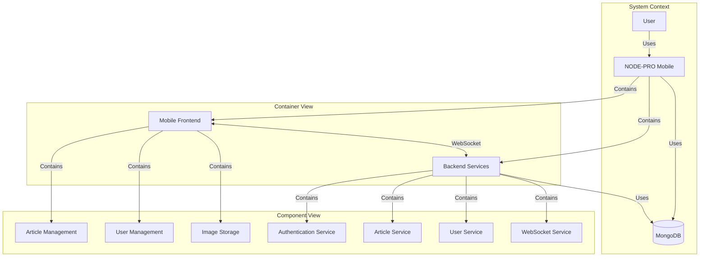

# NODE-PRO Mobile

## Description du Projet

Ce projet est une version mobile de l'application web NODE-PRO, développée avec React Native. Il vise à offrir une expérience mobile fluide tout en maintenant une synchronisation avec la version web grâce à une architecture de microservices.

## C4 Diagram

Here's a high-level C4 diagram of the NODE-PRO Mobile system:

## Design Patterns

The project utilizes several design patterns:

1. **MVC (Model-View-Controller)**: The backend follows an MVC pattern, with models representing data structures, controllers handling business logic, and views (in this case, API responses) presenting data.

2. **Repository Pattern**: Used in the backend to abstract data access logic, making it easier to switch between different data sources if needed.

3. **Observer Pattern**: Implemented through WebSockets for real-time updates, allowing clients to be notified of changes in the system.

4. **Singleton Pattern**: Used for database connection and WebSocket server to ensure a single instance is shared across the application.

5. **Middleware Pattern**: Employed in Express.js for authentication, error handling, and request processing.

## Technology Stack

- **Frontend**:

  - React Native
  - Expo (for easier development and testing)
  - WebSocket client for real-time communication

- **Backend**:

  - Node.js
  - Express.js
  - MongoDB (with Mongoose ODM)
  - WebSocket (ws library)
  - JSON Web Tokens (JWT) for authentication

- **DevOps**:
  - Git for version control
  - npm for package management

## Objectifs Clés

1. Maintenir la parité des fonctionnalités avec la version web
2. Assurer la cohérence des données entre les plateformes
3. Optimiser l'expérience utilisateur mobile
4. Mettre en place une gestion efficace de l'état de l'application
5. Utiliser les meilleures pratiques de React Native et Expo

## Phases de Développement Prévues

1. Mise en place de la structure du projet React Native
2. Adaptation du backend à l'architecture microservices
3. Implémentation de l'authentification des utilisateurs dans l'app mobile
4. Développement des fonctionnalités de gestion des articles
5. Intégration de la synchronisation en temps réel
6. Implémentation de la fonctionnalité de scan de code-barres
7. Optimisation des performances et de l'interface utilisateur
8. Tests approfondis et débogage

## Défis à Relever

- Gestion efficace de l'état dans React Native
- Implémentation d'une authentification sécurisée dans un environnement mobile
- Assurer une synchronisation en temps réel fluide entre les versions web et mobile
- Optimisation des performances de l'application et réduction des temps de chargement
- Gestion du mode hors ligne et persistance des données

## Mises à Jour Récentes

1. Implémentation de la fonctionnalité de téléchargement et de stockage d'images pour les articles.
2. Refactorisation du backend pour utiliser une architecture de microservices.
3. Ajout du support WebSocket pour les mises à jour en temps réel.
4. Mise à jour du frontend pour gérer les téléchargements et l'affichage des images.
5. Amélioration de la gestion des erreurs et de la journalisation dans toute l'application.

## Prochaines Étapes

1. Implémenter le support hors ligne pour l'application mobile.
2. Ajouter des tests unitaires et d'intégration pour le frontend et le backend.
3. Implémenter une couche de mise en cache pour améliorer les performances.
4. Renforcer les mesures de sécurité, y compris la limitation de débit et la validation des entrées.
5. Développer un pipeline CI/CD pour l'automatisation des tests et du déploiement.

## À Propos

Ce projet est une extension de l'application web NODE-PRO originale, visant à fournir une solution mobile complète tout en tirant parti de l'architecture microservices pour une intégration transparente entre les plateformes web et mobile.
